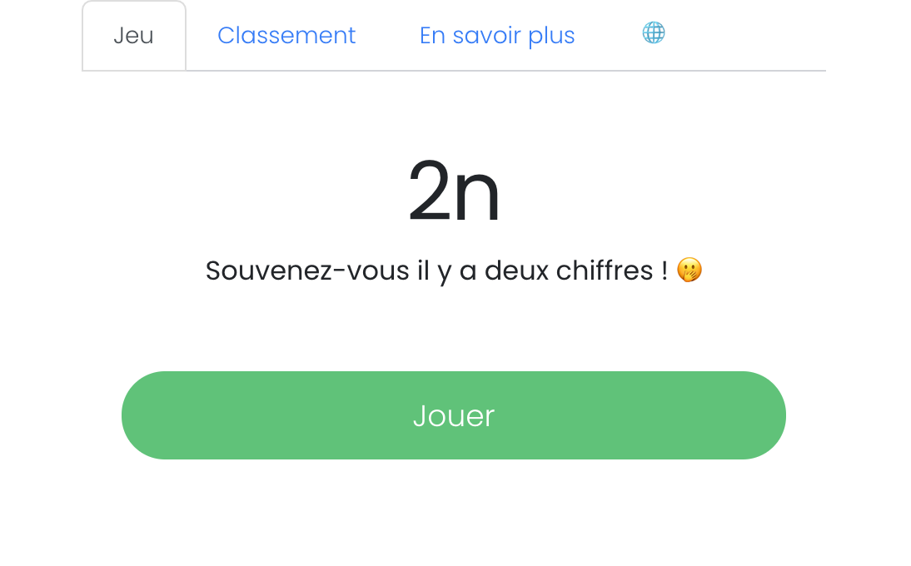
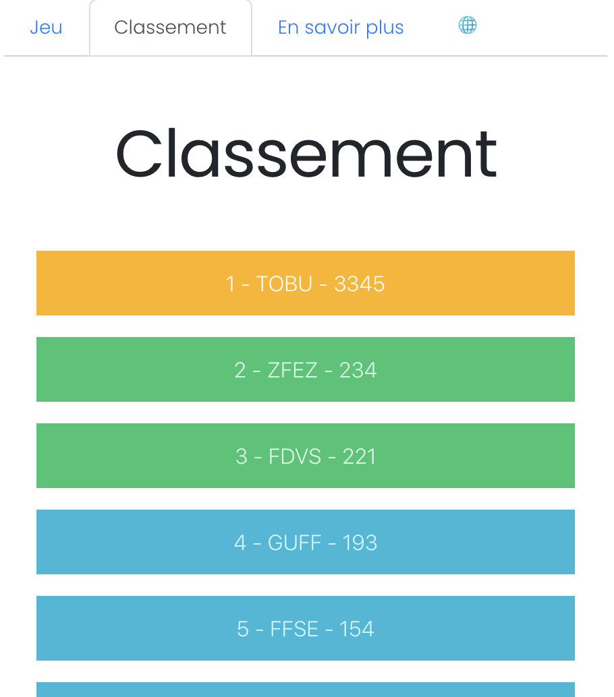
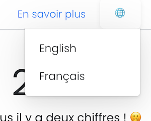

# 2n

Will you remember 2 digits ago?

_[french version of this readme](https://github.com/tobudim/2n/)_



## Game

This project is inspired by the psychotechnical tests to be performed to become a pilot at Air France.

The fabulous [Pilotest] site (https://pilotest.com) has developed excellent tests of this nature, must see!

This game uses these technologies: React.js, TypeScript, Reach Router, Shards React, react-i18next and Cypress.

### Ranking

The game has an old fashioned ranking system!



### Languages

The game is offered in English and French ... for what it costs ... Hey! I'm doing this little game to show off my skills so I couldn't be too lazy!



## How it works

When the project is finished it will be available at [dimitribourreau.me/2n](https://dimitribourreau.me/2n).

For now, you can start the server with:

```bash
npm start
```
